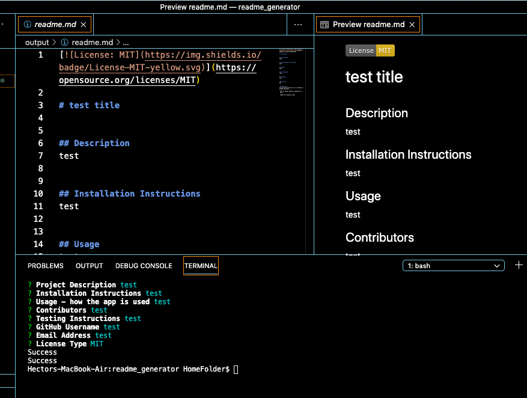

# Readme Generator

## Description 
A prompt based module that runs in the Terminal to create a detailed readme.md file as well as a license.md file based on the user input

## Installation
Once you have the readmeGenerator package and are in the root directory, install the npm inquirer package.
See the video in the Usage section for more info.

## Usage 

Click [here](https://drive.google.com/file/d/12ycW2WmJyx2OBaqHG3z2DlHpVAi6s7Xr/view?usp=sharing] to see an instructional video.

Once all dependencies are installed simply type `node index.js` in the terminal.
The user is led through a series of prompts regarding information in the readme.
Once the user has selected the license type markdown files of the readme and license are saved into the output directory.

## Credits
I developed this app myself.
It relies heavily on the npm package [inquirer](assets/images/screenshot.png).
License badges are found at [artem-solovev’s Github Repo](https://gist.github.com/artem-solovev/e1602722f84835f35daef4dfb3df5500).
The text of the licensing.md file generated by the app is found at [nicolasdao’s repo](https://gist.github.com/nicolasdao/a7adda51f2f185e8d2700e1573d8a633#licenses).

## License
MIT

## Questions?
You can always reach out at hkfernandezdev.gmail.com.
Thanks for taking the time!